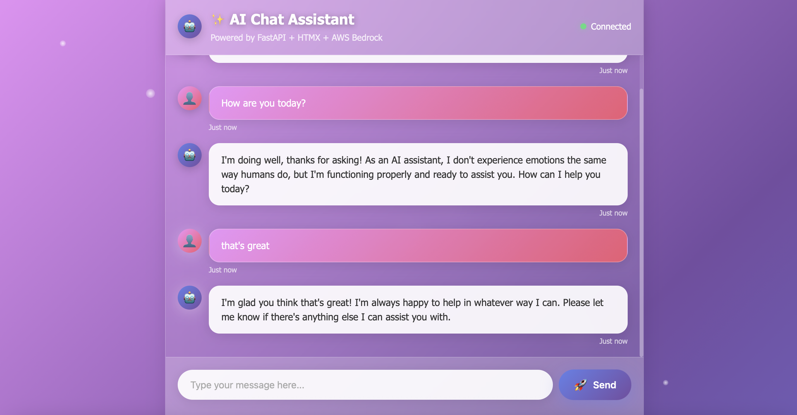
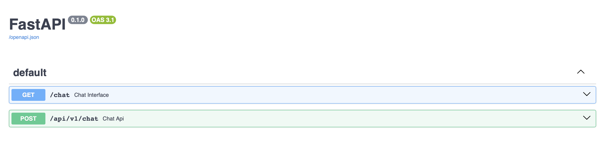

# ✨ AI Chat Assistant - FastAPI + HTMX + AWS Bedrock

A **stunning, modern chat application** with an animated HTMX frontend that communicates with a FastAPI backend, powered by AWS Bedrock for AI responses. Features beautiful floating particles, dynamic gradients, and smooth animations.

## 🎯 **Live Demo**
- **🎨 Chat Application**: http://localhost:8000/chat
- **📚 API Documentation**: http://localhost:8000/docs

## 📸 **Screenshots**

### Beautiful Chat Interface


### API Documentation


## 🚀 **Quick Start**

### 1. **Launch the Application**
```bash
docker-compose up --build -d
```

### 2. **Access the Application**
- **🎨 Beautiful Chat Interface**: http://localhost:8000/chat
- **📚 Interactive API Docs**: http://localhost:8000/docs

## ✨ **Features**

### 💬 **Chat Functionality**
- **Real-time AI chat** with AWS Bedrock (Claude)
- **HTMX-powered** dynamic updates without page refresh
- **Instant responses** with typing indicators
- **Message history** with smooth animations
- **Error handling** with user-friendly messages

### 🔧 **Backend Features**
- **Versioned API endpoints** (v1)
- **Dual response format** (HTML for HTMX, JSON for API)
- **CORS support** for cross-origin requests
- **Template rendering** with Jinja2
- **Static file serving** for CSS/JS assets

## 🔌 **API Endpoints (Only 2!)**

| Method | Endpoint | Response Type | Description |
|--------|----------|---------------|-------------|
| `GET` | `/chat` | HTML | Main HTMX chat interface |
| `POST` | `/api/v1/chat` | HTML/JSON | Chat endpoint (auto-detects HTMX vs JSON) |

## 🧪 **Testing**

### **Web Interface**
1. Open **http://localhost:8000/chat**
2. Type a message and press Enter or click Send
3. Watch the beautiful animations and real-time responses

### **API Testing**
```bash
# Test chat API with JSON
curl -X POST http://localhost:8000/api/v1/chat \
  -H "Content-Type: application/json" \
  -d '{"message": "Hello, how are you?"}'

# Test chat API with form data (simulates HTMX)
curl -X POST http://localhost:8000/api/v1/chat \
  -H "Content-Type: application/x-www-form-urlencoded" \
  -H "HX-Request: true" \
  -d "message=Hello from form"
```

## 📁 **Project Structure**

```
FastAPI-htmx/
├── 📄 README.md                    # Project documentation
├── 📄 .env                        # AWS credentials & configuration
├── 📄 docker-compose.yml          # Docker orchestration
│
├── 🔧 backend/                    # FastAPI Backend + HTMX Frontend
│   ├── 📄 app.py                  # Main FastAPI application
│   ├── 📄 requirements.txt        # Python dependencies
│   ├── 📄 Dockerfile             # Container setup
│   │
│   ├── 📁 templates/              # Jinja2 HTML templates
│   │   ├── 📄 index.html          # Main chat interface
│   │   ├── 📄 chat_messages.html  # Message components
│   │   └── 📄 error.html          # Error handling
│   │
│   └── 📁 static/                 # Static assets
│       ├── 📁 css/
│       │   └── 📄 style.css       # Beautiful animations & styling
│       └── 📁 js/
│           └── 📄 app.js          # HTMX enhancements
```

## 🔄 **How It Works**

### **HTMX Flow:**
```
User Input → HTMX Form → /api/v1/chat → AWS Bedrock → HTML Response → Dynamic Update
```

### **API Flow:**
```
JSON Request → /api/v1/chat → AWS Bedrock → JSON Response
```

1. **User types message** in the HTMX form
2. **HTMX sends form data** to `/api/v1/chat` endpoint
3. **FastAPI detects HTMX** and processes accordingly
4. **AWS Bedrock (Claude)** generates AI response
5. **FastAPI renders HTML** template for HTMX or JSON for API
6. **HTMX updates DOM** with new message bubbles

## 🔧 **Development**

### **Local Development**
```bash
cd backend
pip install -r requirements.txt
uvicorn app:app --reload --port 8000
```

### **Container Management**
```bash
# Start containers
docker-compose up --build -d

# View logs
docker-compose logs -f

# Stop containers
docker-compose down

# Rebuild and restart
docker-compose up --build -d
```

## 🚀 **Why HTMX?**

- **Simpler than React**: No complex build process or state management
- **Server-side rendering**: Templates rendered on the server
- **Progressive enhancement**: Works without JavaScript
- **Smaller bundle size**: Just include HTMX script
- **Real-time updates**: Dynamic DOM updates with minimal code
- **SEO friendly**: Server-rendered HTML content

Perfect for rapid prototyping and production-ready applications!
