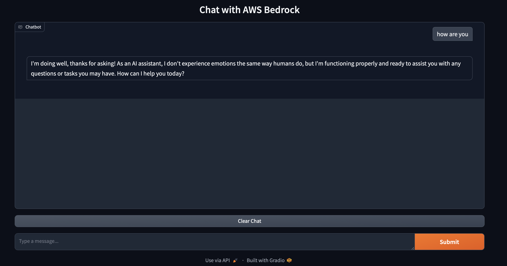
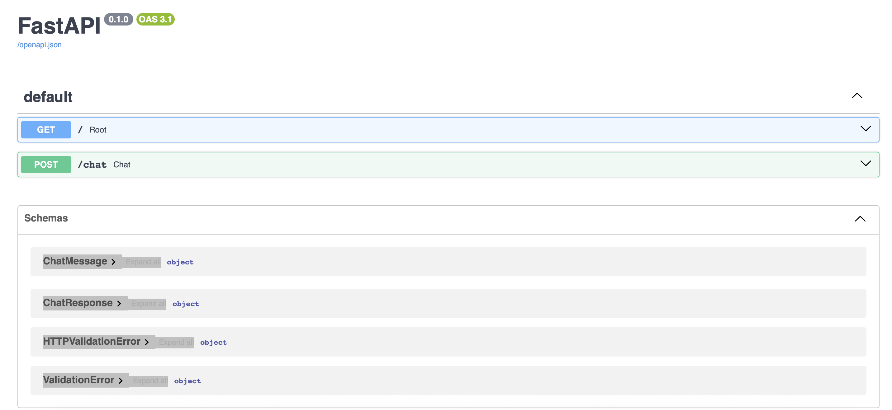
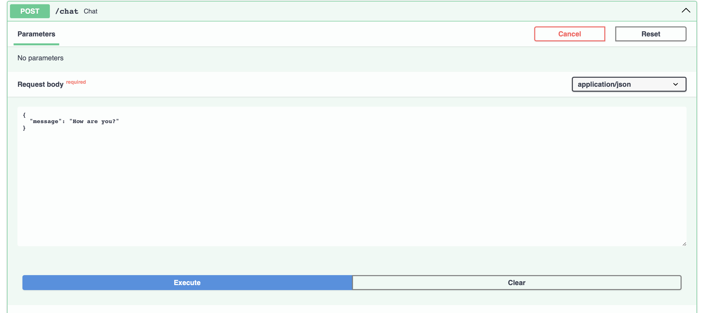
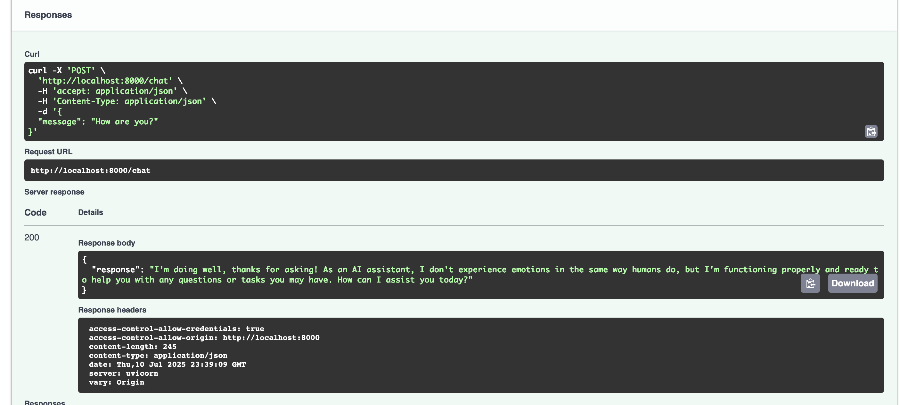

# Simple Chat App with FastAPI + Gradio + AWS Bedrock

A minimal chat application where Gradio frontend talks to FastAPI backend, which uses AWS Bedrock for AI responses.

## Project Structure

```
fastapisimple/
├── backend/
│   ├── app.py              # FastAPI server (2 endpoints: / and /chat)
│   ├── requirements.txt    # Essential Python packages only
│   └── Dockerfile         # Container setup
├── frontend/
│   ├── gradio_app.py      # Simple Gradio chat interface
│   ├── requirements.txt   # Python packages  
│   └── Dockerfile        # Container setup
├── screenshots/
│   ├── frontend.png       # Gradio chat interface screenshot
│   ├── UI.png            # FastAPI documentation screenshot
│   ├── UI2.png           # API testing interface screenshot
│   └── UI3.png           # API response details screenshot
├── .dockerignore         # Docker build context exclusions
├── .env                  # Environment variables (placeholder values)
├── .gitignore           # Git ignore patterns
├── docker-compose.yml   # Multi-container orchestration
└── README.md            # Project documentation
```

## Screenshots

### Gradio Chat Interface

*Clean Gradio chat interface with AWS Bedrock AI responses and message history*

### FastAPI Documentation

*Auto-generated FastAPI documentation showing available endpoints and schemas*

### API Testing Interface

*Interactive API testing with request body and parameter configuration*

### API Response Details

*Detailed API response showing successful chat endpoint execution with headers*

## How Frontend Connects to Backend

### The Connection Flow:
1. **User types message** in Gradio chat interface
2. **Gradio sends HTTP POST** to FastAPI backend at `http://backend:8000/chat`
3. **FastAPI receives message** and calls AWS Bedrock
4. **AWS Bedrock returns AI response** to FastAPI
5. **FastAPI sends response back** to Gradio
6. **Gradio displays response** in chat interface

### Code Connection:

**Frontend (gradio_app.py):**
```python
# When user sends message, this function runs:
def chat_with_backend(message, history):
    response = requests.post(
        f"{BACKEND_URL}/chat",           # Calls backend
        json={"message": message},       # Sends user message
        timeout=30
    )
    return response.json().get("response")
```

**Backend (app.py):**
```python
# Receives the message and processes it:
@app.post("/chat")
async def chat(chat_message: ChatMessage):
    # Calls AWS Bedrock with user message
    # Returns AI response back to frontend
```

## Quick Start

### 1. Add Your AWS Credentials
Edit `.env` file:
```bash
AWS_ACCESS_KEY_ID=your_access_key_here
AWS_SECRET_ACCESS_KEY=your_secret_key_here
AWS_REGION=us-east-1
```

### 2. Run the Application
```bash
docker-compose up --build
```

### 3. Open in Browser
- **Chat App**: http://localhost:7860
- **API Backend**: http://localhost:8000
- **API Documentation**: http://localhost:8000/docs

## What Each Part Does

### Backend (FastAPI)
- **Port**: 8000
- **Job**: Receives chat messages, calls AWS Bedrock, returns AI responses
- **Endpoints**: 
  - `GET /` - Simple status check
  - `POST /chat` - Main chat endpoint

### Frontend (Gradio) 
- **Port**: 7860 (Gradio default)
- **Job**: Provides simple chat interface, sends messages to backend
- **Features**: 
  - Clean chat interface with message history
  - Clear chat functionality
  - Minimal, focused design

### Docker Setup
- Both services run in separate containers
- `docker-compose.yml` connects them together
- Frontend can reach backend using `http://backend:8000`
- Health check monitors backend availability

## Requirements

- Docker and Docker Compose
- AWS account with Bedrock access
- AWS credentials with Bedrock permissions

## Troubleshooting

**Can't connect to backend?**
- Check if both containers are running: `docker-compose ps`
- Check backend logs: `docker-compose logs backend`

**AWS errors?**
- Verify credentials in `.env` file
- Check Bedrock model access in AWS Console

**Port already in use?**
- Stop other applications using ports 8000 or 7860
- Or change ports in `docker-compose.yml`

## Development

To run locally without Docker:

**Backend:**
```bash
cd backend
pip install -r requirements.txt
uvicorn app:app --reload --port 8000
```

**Frontend:**
```bash
cd frontend
pip install -r requirements.txt
BACKEND_URL=http://localhost:8000 python gradio_app.py
```
